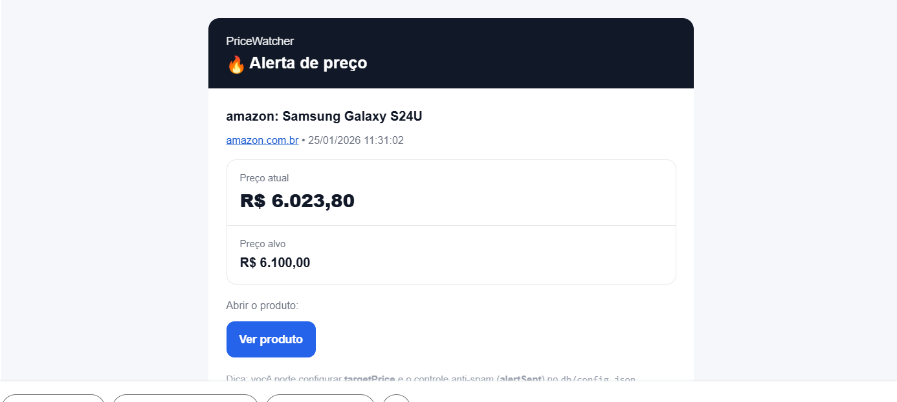

# 📊 PriceWatcher — Monitoramento de Preços com Alertas

Serviço em Python para monitorar preços em páginas web, registrar logs e enviar alertas por e‑mail de forma **automática ou manual**, com controle anti‑spam.

---



## 🚀 Funcionalidades

- Monitoramento periódico de preços via scraping
- Suporte a múltiplos sites e seletores (`sites.json`)
- Alertas automáticos por **preço alvo**
- Envio manual de e‑mail (`sendNow`)
- Controle anti‑spam (`alertSent`)
- Logs separados (info, sucesso e erro)
- Hot‑reload de configurações
- Worker com fila (execução controlada)

---

## 📁 Estrutura do Projeto

```
.
├── main.py
├── db/
│   ├── config.json
│   ├── sites.json
│   └── email.ini
├── logs/
│   ├── info.log
│   ├── log_success.log
│   └── log_erros.log
└── README.md
```

---

## ⚙️ Configuração das Tasks (`db/config.json`)

Exemplo:

```json
{
  "tasks": [
    {
      "id": "7bd563",
      "description": "zonasul cafe 3 coracoes",
      "url": "https://www.zonasul.com.br/produto",
      "times": ["10:00", "18:00"],
      "status": true,

      "targetPrice": 15.98,
      "alertSent": true,
      "sendNow": false,

      "lastValue": "R$ 15,98",
      "lastRun": "2026-01-24T17:02:00"
    }
  ]
}
```

### Campos importantes

| Campo | Descrição |
|------|-----------|
| `targetPrice` | Preço alvo para alerta automático deve ser tipo número exemplo: `"targetPrice": 11000.0`
| `alertSent` | Controla se o alerta automático, ao chegar no preço setado o email é enviado e será `alertSent: false` evitando enviar futuros emails, também temos `task["alertSent"] = True` que rearma quando o preço voltar a subir e posteriormente vai alertar quando o preço  baixar.

| `sendNow` | Força envio o envio do email mesmo que não atenda as condições do alerta, (codigo comentado pra enviar sempre if task.get("sendNow", False):) descomentar para o sendNow funcionar apenas 1x
| `lastValue` | Último valor capturado |
| `lastRun` | Última execução |

---

## 📐 Lógica de Decisão (Alertas)

```
Preço capturado
│
├─ sendNow = true
│   ├─ ENVIA EMAIL imediatamente
│   ├─ sendNow = false (auto‑reset)
│   └─ FIM
│
└─ sendNow = false ou inexistente
    │
    ├─ targetPrice NÃO existe
    │   └─ Apenas loga (sem email)
    │
    └─ targetPrice existe
        │
        ├─ preco_atual > targetPrice
        │   ├─ alertSent = true (rearmado)
        │   └─ NÃO envia email
        │
        └─ preco_atual <= targetPrice
            │
            ├─ alertSent = true
            │   ├─ ENVIA EMAIL
            │   └─ alertSent = false
            │
            └─ alertSent = false
                └─ NÃO envia (anti‑spam)
```

---

## 🌐 Configuração de Sites (`db/sites.json`)

```json
{
  "zonasul.com.br": {
    "price": {
      "selector": ".vtex-difference__por"
    }
  },
  "amazon.com.br": {
    "price": {
      "selector": ".a-price-whole"
    }
  }
}
```

---

## ✉️ Configuração de E‑mail (`db/email.ini`)

```ini
[email]
email=sga@appsga.com.br
senha=123456
remetente=sga@appsga.com.br
smtp=smtp.seudominio.com
portaSmtp=465
autenticacao=1
destinatarios=seuemail@dominio.com,outro@dominio.com
```

---

## 📝 Logs

| Arquivo | Conteúdo |
|-------|----------|
| `info.log` | Execução geral |
| `log_success.log` | Capturas e alertas |
| `log_erros.log` | Falhas e exceções |

---

## ▶️ Execução

```bash
python main.py
```

O serviço:
- agenda as tarefas
- executa em background
- monitora alterações no `config.json`
- envia alertas conforme regras

---

## 🧠 Observações

- `sendNow` tem **prioridade total**
- `alertSent` evita spam
- Logs são gravados **sempre**
- Sistema tolerante a falhas de parsing

---

## 📌 Próximos passos (opcional)

- Histórico de preços
- Dashboard web
- Alertas via Telegram / Discord
- Exportação CSV

---

**Autor:** Geraldo  
**Projeto:** PriceWatcher
